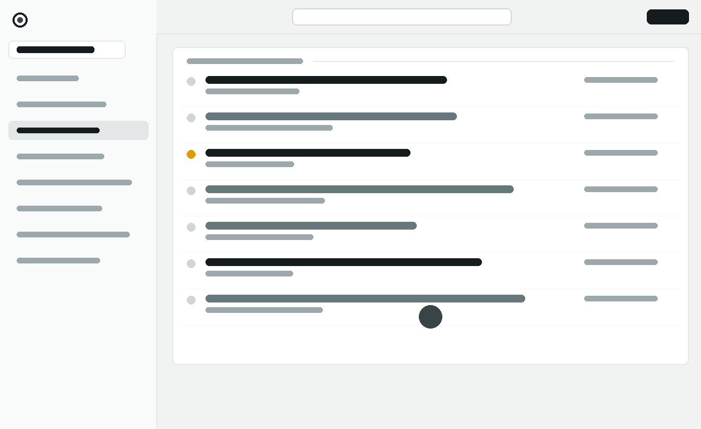

# Atelier

A modern light and dark theme for [FreshRSS](https://freshrss.org/) inspired by
contemporary shadcn/ui interfaces.

Atelier combines the structure of FreshRSS's official Mapco theme with a
separate visual override layer, a cool neutral Mist color palette, soft active
states, subtle motion, and Lucide icons. It does not load web fonts, scripts,
or other runtime assets from external services.



## Features

- Light and dark neutral interfaces that follow the operating-system preference
- Responsive desktop and mobile layouts
- Animated sidebar collapse without content reflow
- Clear visual hierarchy for controls and content
- Accessible focus states and reduced-motion support
- Locally bundled SVG icons with no CDN dependency
- RTL layout support

## Compatibility

Atelier 1.1 has been tested with FreshRSS 1.29.1 in Chromium, including list
and article views, configuration pages, sidebar behavior, search, and a mobile
viewport.

The component layer has also been checked in Firefox with representative dark,
mobile, and RTL fixtures. Complete FreshRSS workflows in Firefox and RTL
layouts, and FreshRSS versions other than 1.29.1, have not yet been explicitly
tested.

## Installation

### Manual installation

1. Download or clone this repository.
2. Ensure that the theme directory is named `Atelier`.
3. Copy the complete directory to `<FreshRSS>/p/themes/Atelier`.
4. Open FreshRSS and select **Configuration → Display → Theme → Atelier**.

The repository root is also the theme root. No build or copy step is required
before installation.

### Docker Compose bind mount

Replace the host path with the absolute path to your checkout:

```yaml
services:
  freshrss:
    volumes:
      - /absolute/path/to/Atelier:/var/www/FreshRSS/p/themes/Atelier:ro
```

Select Atelier in FreshRSS after starting or restarting the container. The
read-only mount prevents the container from modifying the checkout.

## Customization

Theme colors are defined centrally in [`_variables.css`](_variables.css). The
commented Mist values can be replaced with another neutral palette without
changing the component rules. Run the RTL generator after changing these
tokens instead of editing `_variables.rtl.css` manually.

Atelier follows the browser's `prefers-color-scheme` value automatically. It
does not require JavaScript or store a separate theme preference.

```console
python3 scripts/generate_rtl.py
```

## License and credits

Atelier is derived from the official
[Mapco theme](https://github.com/FreshRSS/FreshRSS/tree/1.29.1/p/themes/Mapco)
by Thomas Guesnon and the FreshRSS project. The theme is distributed under the
[GNU Affero General Public License version 3](LICENSE).

The 55 Lucide UI icons retain their `lucide-static` 1.31.0 ISC headers. The
complete Lucide and Feather license notices are available in
[`icons/LICENSE`](icons/LICENSE). The remaining logo assets are derived from
FreshRSS and Mapco. See [`THIRD-PARTY.md`](THIRD-PARTY.md) for detailed
attribution.

Credits:

- Thomas Guesnon and the FreshRSS project for Mapco and the theme foundation
- Lucide Contributors for the Lucide icon set
- Cole Bemis and Feather Contributors for icons inherited through Lucide
- shadcn/ui and Tailwind CSS as design and color references
