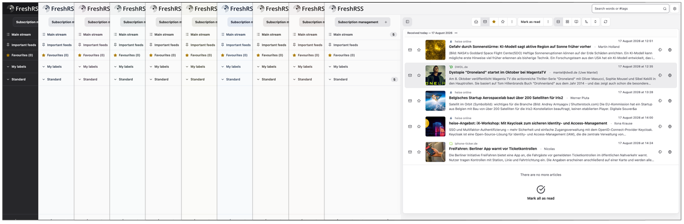

# Atelier

A calm light and dark theme for [FreshRSS](https://freshrss.org/), inspired by shadcn/ui — in nine neutral palettes.


Atelier gives FreshRSS a neutral palette, a clear reading hierarchy, soft radii, and subtle motion. It follows your operating system's light or dark setting on its own, and everything it needs ships with the theme — no web fonts, no scripts, nothing loaded from an external service while you read.

## The nine palettes

Each folder in this repository is a complete theme, and they differ in exactly one thing: the neutral ramp they are built on, taken from Tailwind CSS 4.3. Everything else — layout, typography, the accent hues for success, warning and error — is identical. Install one, or install several and switch between them in FreshRSS.



| Theme | Neutral |
| --- | --- |
| [`Atelier-Slate`](Atelier-Slate/) | A cool grey with a blue cast |
| [`Atelier-Gray`](Atelier-Gray/) | A neutral grey, faintly blue |
| [`Atelier-Zinc`](Atelier-Zinc/) | A grey with a trace of violet |
| [`Atelier-Neutral`](Atelier-Neutral/) | Grey without a hue |
| [`Atelier-Stone`](Atelier-Stone/) | A warm grey |
| [`Atelier-Taupe`](Atelier-Taupe/) | A grey-brown that leans red |
| [`Atelier-Mauve`](Atelier-Mauve/) | A grey with a muted purple cast |
| [`Atelier-Mist`](Atelier-Mist/) | A cool grey with a trace of cyan |
| [`Atelier-Olive`](Atelier-Olive/) | A grey-green that leans yellow |

Every one of them clears the same contrast bars, in light and dark alike; see [Development](#development).

## Features

- Nine neutral palettes, each a self-contained theme
- Light and dark interfaces that follow your system preference automatically
- Layouts for desktop and mobile, including a collapsible sidebar
- Locally bundled Lucide icons, so nothing is fetched from a CDN
- Visible focus states and support for reduced-motion settings
- Right-to-left layout support

## Requirements

**FreshRSS 1.29.1.** That is the version Atelier is built and tested against. Other versions will most likely work, but the theme follows FreshRSS's markup closely, so a larger FreshRSS update may need a matching theme update.

**A browser from 2024 or later.** Atelier uses modern CSS — nesting, `:has()`, subgrid, `color-mix()` and `:dir()` — which in practice means Chrome or Edge 120+, Firefox 121+, or Safari 17.2+. Older browsers will render the page, but parts of the layout will look wrong.

## Installation

Copy the `Atelier-*` folders you want into `p/themes/` inside your FreshRSS installation, and pick one in the settings. Each folder is complete on its own — there is nothing to build, and nothing outside the folder it needs.

**Keep the folder names as they are.** FreshRSS stores the folder name as the theme's identity, so renaming `Atelier-Stone` later resets the theme selection of everyone using it.

### Download as a ZIP

1. Download the repository as a ZIP archive and unpack it.
2. Move the `Atelier-*` folders you want into `<FreshRSS>/p/themes/`. Take one, take all nine — they sit beside each other without interfering.

The unpacked archive also contains `src/`, `scripts/` and `palettes/`. Those build the themes; FreshRSS has no use for them, so leave them out of `p/themes/`.

### Clone with Git

Clone anywhere and copy the folders across:

```console
git clone https://github.com/mbieh/Atelier.git ~/atelier
cp -r ~/atelier/Atelier-Mist /path/to/FreshRSS/p/themes/
```

### Docker Compose

Mount the folders you want, one volume each. Read-only (`:ro`) keeps the container from writing to them:

```yaml
services:
  freshrss:
    volumes:
      - /absolute/path/to/Atelier-Mist:/var/www/FreshRSS/p/themes/Atelier-Mist:ro
      - /absolute/path/to/Atelier-Stone:/var/www/FreshRSS/p/themes/Atelier-Stone:ro
```

Restart the container afterwards.

### Activate it

Open FreshRSS and choose **Configuration → Display → Theme**, then the palette you installed — for example **Atelier Mist**.

### Updating

Pull or download the new version and copy the folders over the installed ones:

```console
cd ~/atelier && git pull
cp -r ~/atelier/Atelier-Mist /path/to/FreshRSS/p/themes/
```

Then reload FreshRSS. If the page still looks unchanged, force-reload it with `Ctrl`/`Cmd` + `Shift` + `R`.

### Removing

Switch to another theme under **Configuration → Display**, then delete the `<FreshRSS>/p/themes/Atelier-*` folders you no longer want.

## Light and dark mode

Atelier follows your operating system's appearance setting. Switch your system to dark mode and FreshRSS turns dark on the next page load. There is no separate switch inside FreshRSS, and no preference is stored.

## How the palettes work

A theme folder differs from its siblings in one file: `_palette.css`, a neutral ramp of eleven steps. Everything else is byte-for-byte identical.

That works because no component ever names a color. Every rule asks for a role — background, foreground, border, accent — and [`src/_variables.css`](src/_variables.css) maps those roles onto steps of the ramp. Which step a role gets is decided by the contrast it needs, so a different palette keeps the theme readable instead of only recoloring it.

The icons cannot be tokens, because they are files rather than CSS: an external SVG cannot inherit the page's `currentColor`, so each one carries a literal stroke. They are authored once in Mist and re-rendered into each folder's ramp by the build.

The preview each folder shows in the theme picker is drawn by hand, one per palette, and the build neither writes nor removes it. A screenshot re-tinted from one canonical rendering only approximates what a palette looks like, which is exactly what a preview is there to answer.

### Adding a palette

Add its OKLCH steps to [`palettes/ramps.json`](palettes/ramps.json) and rebuild:

```console
python3 scripts/build_themes.py
python3 scripts/check_theme.py
```

The first writes a tenth folder; the second tells you whether the new ramp holds every contrast bar the theme promises, in light and dark. If it does not, that is a real answer — not every neutral is usable at every step.

## Troubleshooting

**Atelier does not show up in the theme list.** Check that `<FreshRSS>/p/themes/Atelier-Mist/metadata.json` exists — with the palette you installed in place of Mist — and that your web server user is allowed to read the folder.

**The page looks unstyled or the layout is broken.** Usually an outdated browser — see [Requirements](#requirements). Otherwise force-reload the page.

**Dark mode does not turn on.** Atelier follows the system setting, not a FreshRSS setting. Check your operating system's appearance preference.

**Some pages still look like the previous theme.** Force-reload the page; browsers hold on to stylesheets aggressively.

## Development

The shared source lives in [`src/`](src/); the nine `Atelier-*` folders are generated from it and committed, so that installing means copying a folder rather than running a build.

```console
python3 scripts/build_themes.py          # regenerate the nine folders from src/
python3 scripts/build_themes.py --check  # fail if a folder has drifted from its source
python3 scripts/check_theme.py           # the release checks
```

Edit `src/`, never a theme folder — a folder is overwritten by the next build. The one exception is `thumbs/`, which holds the hand-drawn preview for the theme picker: the build leaves it alone, and `check_theme.py` only insists that every folder has one.

`check_theme.py` runs the same checks as CI: CSS structure, metadata, links, icon licenses, a guard that rejects direction-sensitive CSS before it can reach a right-to-left copy, and a WCAG contrast check that resolves every semantic role against the surfaces it is painted on — for all nine palettes, in both color schemes, which is 756 pairings.

This repository is a mirror: development happens on a private Forgejo instance and is pushed here. A pull request therefore cannot be merged into it, though it is still the clearest way to show me a patch — I apply it by hand and credit you in the changelog. Issues are unaffected.

See [`CHANGELOG.md`](CHANGELOG.md) for release notes and [`docs/component-coverage.md`](docs/component-coverage.md) for the component matrix.

## License and credits

Atelier is derived from the official [Mapco theme](https://github.com/FreshRSS/FreshRSS/tree/1.29.1/p/themes/Mapco) by Thomas Guesnon and the FreshRSS project, and is distributed under the [GNU Affero General Public License v3](LICENSE).

The bundled Lucide icons keep their `lucide-static` 1.31.0 ISC headers; the full Lucide and Feather notices are in [`src/icons/LICENSE`](src/icons/LICENSE), and beside the icons in every theme folder. See [`THIRD-PARTY.md`](THIRD-PARTY.md) for detailed attribution.

Thanks to Thomas Guesnon and the FreshRSS project for Mapco, to the Lucide contributors and to Cole Bemis and the Feather contributors for the icons, and to shadcn/ui and Tailwind CSS as design and color references.
